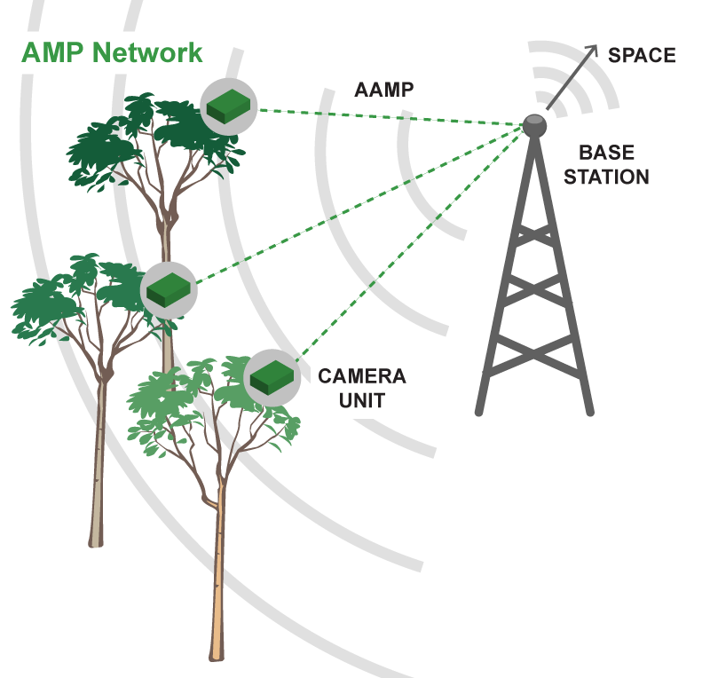
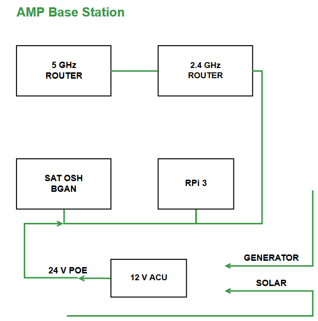
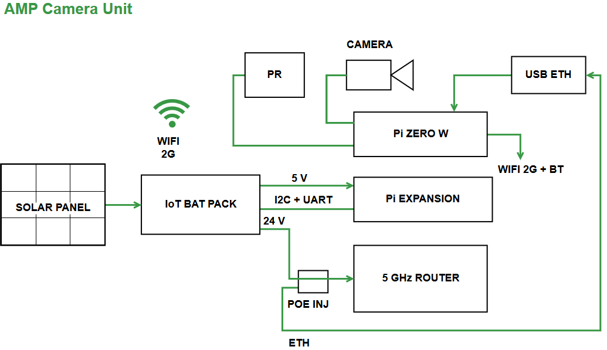

# Arribada Arboreal Monitoring Platform
Camera based Arboreal Monitoring Platform with WiFi connactivity and solar power for remote area deployment. The solution is designed with open hardware and software solutions.

To establish an effective wireless network in dense forested environments it’s necessary to escape the wet leaves and foliage below the canopy. Field conservationists often attempt to deploy wireless equipment with an expectation that radio waves will penetrate thick buttress roots and tangled vines, yet in reality, attempts struggle to achieve more than a few hundred metres if placed at ground level. Specifically, attempts to establish wireless networks within forested environments to transmit photographic data from remote camera traps have required a series of dedicated masts to be established - an expensive and technically challenging process, and so a new approach is required. By identifying pioneer tree species that have grown above the canopy’s average height it’s possible to link individual trees together using line-of-sight radio hubs. Each hub stores and forwards data received from camera traps placed in the canopy, or the forest floor (up to 100m) to a central location. In this manner, camera traps can be connected using direction antennas to relay photographs and short videos captured in the tree tops for transmission to the internet in real time for identification by citizen scientists or for remote archiving.

## Design overview
The network consists of one or more WiFi base-stations and a number of camera units deployed in the tree tops with a line of sight to the base-station.

### Base station
 * 5GHz sector or omni antenna + 2.4GHz sector
   * Ubiquity Rocket AC PTMP + Nanostation M2 (11W power draw)
 * Backup battery
 * Battery charger
 * Satellite or other uplink

### Camera unit
 * Raspberry Pi Zero W
 * Raspberry Pi v2 Camera
 * [Iot Battery Pack v2](https://github.com/IRNAS/IoT-battery-pack)
   * solar charger
   * 3v3 regualtor module
   * 5v regulator module
   * 18V step-up module
   * 6x 18650 LiPo cells 2600mAh
 * Nodemcu v3 LP processor + EasyESP firmware
 * Voltaic system 17W solar panel
 * Nanuk 925 rugged enclosure
 * Tree moounting brackets
 * PIR sensor
 * WiFi 5GHz directional unit
   * Ubiquiti Nanobeam AC (4.5W when connected, 6.5W under 100Mbps real data load)
   
 
 
### Camera unit power consumption
We estimate the power consumption of the camera based on the following conditions:
 * Operate on average 12h a day during daytime
 * 70% solar cell efficiency due to non-tracked deplyoment
 * Pi Zero W + Camera consumption: 2W
 * WiFi Consumption: 6.5W
 
Lets define operation of an hour when active and assume:
 * WiFi is on for 1 minute every 15 min 
 * Pi Zero is active all the time
 * Unit operates for 12h during the day
 
 In this scenario we have average consumption per hour of about 2.5W for 12h daily, requiring total power of 30Wh daily.
 
 Assuming battery capacity is about 60Wh and solar panel is 17W * 70% efficiency * 80% charge efficiency, then solar power delivered is about 10W. Having at least 3 hours of a sunny day the battery is totally charged in that period. 
 
 
#### Software operation
Nodemcu v3 LP processor with ESP8266 is the main controller for the camera unit and turn on Raspberry Pi when required/scheduled.
 
#### EasyESP custom features
[EasyESP](https://www.letscontrolit.com/wiki) is a firmware for ESP8266 WiFi module implementing support for a range of sensors and may be used with some modifications to operate as a controller for our system, so far we have identified the following features should be implemented:

 * Enable AP mode of operation
 * Enable/disable sleep via serial port and rules
 * Add missing libraries
 * 
 
 
