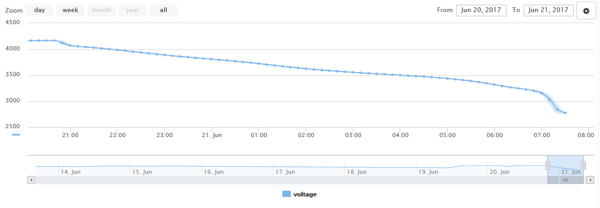

### Testing of the configuration from various aspects

## Battery capacity and shutdown test
The battery capacity has been evaluated under full-load to experimentally determine the useful capacity of the battery tha includes all the conversion and voltage regulation losses.

 * Circuit: Iot battery pack v2 with 6x 2600mAh 18650 cells
 * Start of the test: 4.16V
 * End of the test: 3.32V
 * Capacity: 17500mAh (10h uptime at 1.75A average load)

 * Extended end of the test (hard cut-off): 2.77V
 * Total capacity to hard cut-off: 19300mAh

## Power consumption analysis
The following is the proportion of power used in different states, measured as total drain from battery:

 * IoT battery pack in sleep: 500uA @ 3V = 1.5mW
 * IoT battery pack in standby, wake up every 600s for 60s: 8mA on average @ 3V = 24mW
 * Raspberry Pi Zero W with USB ethernet and camera: 300mA @ 3V = 900mW
 * Ubiquiti WiFi Router: 1750mA @ 3V = 5250mW
 
 
